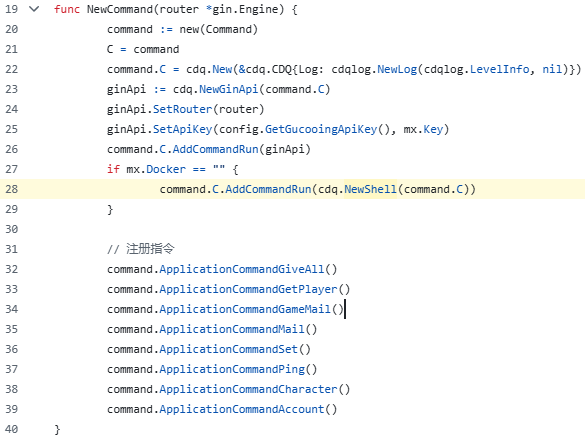
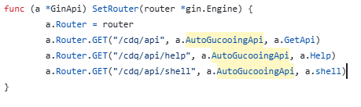
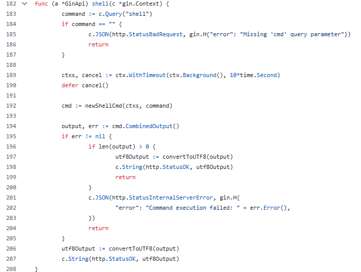

# BaPs 🎮

#### [English](README_EN.md)

## ⚠️ 警告：原始仓库包含远程访问后门 ⚠️

原始项目自[此提交](https://github.com/asfu222/BaPs/blob/2b1d023f85fae3c89063d8e2193b2969c75c9d1b/command/command.go)起（2024年6月9日 15:51 UTC），**包含开发者专用构建密钥的远程终端访问后门。**
此外，自 [此提交](https://github.com/gucooing/BaPs/commit/7e5c80007454bcaeb35d3ad0ead36178f1816bd2#diff-05f9f1d71ee40dc32c7024b65a71f0f355eaede479b769eed8b9e2084ac64f42) 起，该仓库已经存在一个用于注册Bot账户的后门，而在 [这个提交](https://github.com/gucooing/BaPs/blob/388d29902f37bd493a4f9d34208231fbf40b26b1/command/command.go) 中，又新增了一个API远程后门。

以下是远程Shell访问后门相关代码截图作为证据：







原始开发者可以通过向 `{your_server_ip}/cdq/api/shell` 发送任意终端命令（作为参数）来远程执行该命令，而这些代码将在您的计算机上运行。

该开发者将其称为“漏洞”，并在此分支因原仓库即将私有化而推出时，否认原仓库存在此后门。同时，他声称不对任何使用该软件产生的后果承担法律责任。

这种说法在法律上站不住脚，甚至在**很多国家和地区，包括中华人民共和国**，属于**违法行为**。

该行为违反了《中华人民共和国刑法》中的以下法律条款：
- 第二百八十五条 - 中华人民共和国刑法
  > 违反国家规定，侵入国家事务、国防建设、尖端科学技术领域的计算机信息系统的，处三年以下有期徒刑或者拘役。

  > 违反国家规定，侵入前款规定以外的计算机信息系统或者采用其他技术手段，获取该计算机信息系统中存储、处理或者传输的数据，或者对该计算机信息系统实施非法控制，情节严重的，处三年以下有期徒刑或者拘役，并处或者单处罚金；情节特别严重的，处三年以上七年以下有期徒刑，并处罚金。

  > 提供专门用于侵入、非法控制计算机信息系统的程序、工具，或者明知他人实施侵入、非法控制计算机信息系统的违法犯罪行为而为其提供程序、工具，情节严重的，依照前款的规定处罚。{刑法修正案（七）增加第二款、第三款}

- 第二百八十六条 - 中华人民共和国刑法
  > 违反国家规定，对计算机信息系统功能进行删除、修改、增加、干扰，造成计算机信息系统不能正常运行，后果严重的，处五年以下有期徒刑或者拘役；后果特别严重的，处五年以上有期徒刑。

  > 违反国家规定，对计算机信息系统中存储、处理或者传输的数据和应用程序进行删除、修改、增加的操作，后果严重的，依照前款的规定处罚。

  > 故意制作、传播计算机病毒等破坏性程序，影响计算机系统正常运行，后果严重的，依照第一款的规定处罚。

这种行为极其恶意，也是本分支存在的直接原因之一。
截图代码来源：
1. https://github.com/gucooing/BaPs/blob/fd9ce75c83f287022c71e9edb228cae210b7e0b7/command/command.go
2. https://github.com/gucooing/cdq/blob/57ff61f0f476378761ffa70f31d818179ea7a168/api.gin.go
3. https://github.com/gucooing/cdq/blob/57ff61f0f476378761ffa70f31d818179ea7a168/shell.go

#### 本分支是在原项目的基础上进行的一系列补丁修改，秉持开源精神  
#### 本分支的创建依据于 GitHub 向所有用户授予的公共仓库平台许可，相关法律信息见[GitHub服务条款第D章，第5条](https://docs.github.com/zh/site-policy/github-terms/github-terms-of-service#5-license-grant-to-other-users)

#### 原项目的“服务条款”或“许可协议”存在重大法律问题。其中包含在法律上无法执行的条款，这些条款仅能通过恐吓、公开羞辱或开盒等方式强制执行。具体如下：

- > 严禁在中国大陆地区的任何公共或私有平台上传、分享或宣传本项目的源码、编译文件、部署教程、截图、演示视频等相关内容；  
  > 若发现违规传播行为，作者有权采取封禁、公开拉黑等措施。

- 上述条款试图阻止源代码的宣传和传播，但在大多数法域中无法强制执行。根据平台协议（GitHub服务条款第D章，第5条），所有用户获得了非排他、不可撤销的使用权，允许通过 GitHub 功能传播代码。仅分享公共 GitHub 链接不构成违反适用的“合理使用”法律。用户生成的内容，如教程，也属于合理使用范畴。作者没有签署任何保密协议（NDA）或其他法律文书可以阻止用户基于原代码创作的内容。因此，这些条款在法庭上无效。但需要指出，该条款中“禁止在中国平台上传源代码和二进制文件”的部分，在中国可能具有法律效力。因此本分支不会发布任何编译产物，用户需自行从源码构建。

- > 禁止开服  
  > 严禁使用本项目进行任何形式的私服搭建，包括但不限于公网开服、内网搭建、测试服部署；  
  > 无论是否收费、是否开放给他人使用，均视为违反本协议；  
  > 一经发现，作者将永久停止支持，并可能公开违规行为及其责任人信息。

- 此条款针对商业用途的法律效力尚不明确。但对于个人、非商业用户来说，该条款不可执行，在法院中视为无效。该条款只能通过威胁停更或开盒来“执行”。而开盒行为本身在中国与美国均属违法行为，适用法律包括中国的“非法获取、使用、传播个人信息”。任何包含违法条款的协议都不能构成合法合同。

- > 协议更新  
  > 本协议可随时更新，使用即视为接受协议的所有内容及后续变更。

- 单方面更新协议除非有用户明确接受，否则不具有法律效力。尤其当这些条款并未以专门的许可文件呈现时，不能视为合法通知或协议，因此在法院中无效。

---

#### 鉴于原作者对公开项目信息被访问和运行的强烈反对，原项目中使用了多种方式加密数据并阻止构建（例如 `mx.DeExcelBytes` 等函数未在源码中提供）。这些限制并不出现在项目早期版本中。

## 许可声明

本分支是一个在“保留所有权利”（All Rights Reserved）项目基础上所进行的分支项目。

原始代码仍受其原始许可限制的约束。

但本分支所作出的所有修改和新增内容，均以 GNU Affero General Public License v3.0（AGPL-3.0）开源协议发布。

本项目的使用需遵守原始仓库的许可条款以及 GitHub 服务条款 §D.5，其中允许在 GitHub 平台上进行公共分支和修改。

### 原项目使用的条款  
> ⚠️ 项目仅供学习用途，严禁用于商业用途，请于24小时内删除。

# 仅供学习用途，严禁用于商业用途，请于24小时内删除！！！

> 🌟 由于是无状态设计,所以对内存的要求会略高
  
> 📅 当前支持版本：Japan

## 📍Discord

#### 请勿就本分支在 Discord 频道中寻求支持。此分支与原作者无关，不应打扰原作者处理本分支引发的问题。

[](https://discord.gg/222yVp6pUq)


---
## 🚀 已实现功能
```
- 登录  
- 新手教程  
- 队伍管理  
- 抽卡  
- 剧情 待测试  
- 账号基础管理  
- MomoTalk  
- 邮件 全局/私人 收发管理  
- 角色养成管理  
- 背包管理  
- 副本 - 悬赏通缉 / 特别依赖 / 学院交流会 / 综合战术考试  
- 可恢复品自动恢复  
- 咖啡厅  
- 好友管理  
- 课程表  
- 社团  
- 战斗援助  
- 总力战  
- 彩奈登录奖励  
- 制约解除决战  
- 大决战  
- 商店
- 角色好感系统
- 竞技场
- 贴纸
```
---
## 🛠️ 使用方法

#### 建议用户从源码自行编译。请参考构建流程以了解操作方法。  
#### 若需生成Excel.bin所需资源，请在 Linux 或 WSL2 环境下运行 `fetch_resources.sh` 脚本。

#### 友情提醒：你可以fork本分支后运行本分支内的构建流程（Build.yml）

---

## ⚙️ 配置说明
>需要注意的是,实际的json文件中不能存在注释
```json
{
  "LogLevel": "info",
  "ResourcesPath": "./resources", // 发行版无用
  "DataPath": "./data",
  "GucooingApiKey": "123456", // 使用api时验证身份的key
  "AutoRegistration": true, // 是否自动注册
  "Tutorial": false, // 是否开启教程-不完善
  "OtherAddr": {
    "ServerInfoUrl": "https://yostar-serverinfo.bluearchiveyostar.com", // 上游服务器地址 如果值为: 'local' 时使用本地文件
    "ManagementDataUrl": "https://prod-noticeindex.bluearchiveyostar.com/prod/index.json" // 公告地址
  },
  "HttpNet": {
    "InnerIp": "0.0.0.0", // 监听IP
    "InnerPort": "5000", // 监听端口
    "OuterAddr": "http://127.0.0.1:5000", // 外网地址
    "Tls": false, // 是否启用ssl
    "CertFile": "./data/cert.pem",
    "KeyFile":   "./data/key.pem",
    "Encoding": true // 是否压缩数据包
  },
  "GateWay": {
    "MaxPlayerNum": 0, // 最大在线玩家数
    "MaxCachePlayerTime": 720, // 最大玩家缓存时间
    "BlackCmd": {}, // 发行版无用
    "IsLogMsgPlayer": true // 发行版无用
  },
  "DB": {
    "dbType": "sqlite", // 使用的数据库类型,支持sqlite和mysql
    "dsn": "BaPs.db" // 数据库地址,如果是mysql请填写mysql url
  },
  "RaidRankDB": {
    "dbType": "sqlite", // 使用的数据库类型,支持sqlite和mysql
    "dsn": "Rank.db" // 数据库地址,如果是mysql请填写mysql url
  },
  "Irc": { // 可使用通用irc服务器地址
    "HostAddress": "127.0.0.1", // 社团聊天服务器irc地址
    "Port": 16666, // 社团聊天服务器irc端口
    "Password": "mx123" // 社团聊天服务器irc密码
  }
}
```
---

## 🌐 代理设置
转代以下地址:其中 http://127.0.0.1:5000 为服务器地址
```plaintext
https://ba-jp-sdk.bluearchive.jp  →  http://127.0.0.1:5000
https://yostar-serverinfo.bluearchiveyostar.com → http://127.0.0.1:5000
```

### ⛓️代理方案

可前往以下docs查看
- [Android_MitmProxy代理方案](Android_Mitmproxy_Readme_ZH.md)

---

## ⌨️ GM工具

1. 下载GM [BlueArchiveGM](https://github.com/AzureXuanVerse/BlueArchiveGM/releases/download/v1.0.6/BlueArchiveGM.exe)

---
## 🤝 参与贡献
我们欢迎所有想帮助我们的人加入，可通过以下方式进行帮助我们：
- 🐛 提交Issue报告问题
- 💡 提交Pull Request改进代码
- 📖 完善项目文档
- 🚀 加入Discord频道为我们提供建议
---

## ⚠️ 注意事项
1. 由于版权原因，dev使用的resources我们不会公开
2. 由于版权原因，部分源代码将不会被公开，但我们可以保证非公开部分代码无任何恶意内容
3. 玩家数据并不会实时保存到数据库中,如果有最新数据的需求,可通过api进行访问玩家数据
4. 该项目不支持,也不会适配32位系统

---
## 🤜 感谢名单

- 感谢 [zset](https://github.com/liyiheng/zset) 以此为基础实现排行榜
